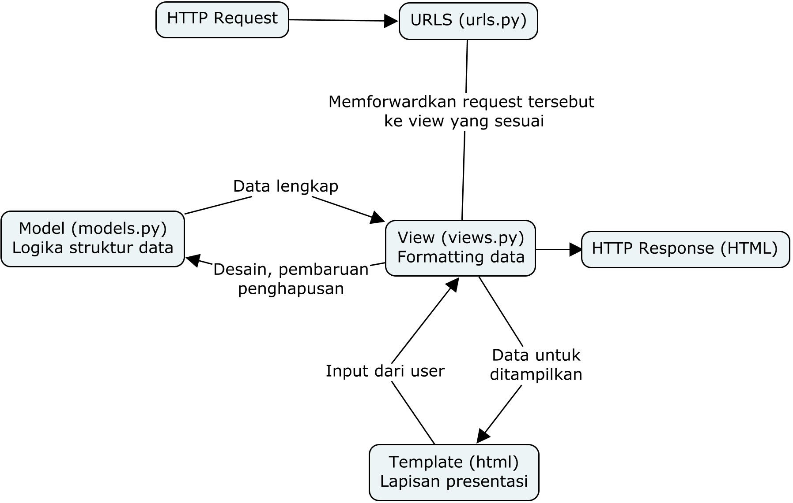

## Link menuju aplikasi Heroku
https://tugas-2-pbp-arkan.herokuapp.com/katalog


## Buatlah bagan yang berisi request client ke web aplikasi berbasis Django 

Bagan created using Cmap (thanks MPKT!)

Source(s):
https://towardsdatascience.com/working-structure-of-django-mtv-architecture-a741c8c64082<br>
https://developer.mozilla.org/en-US/docs/Learn/Server-side/Django/Introduction

## Jelaskan kenapa menggunakan virtual environment? Apakah kita tetap dapat membuat aplikasi web berbasis Django tanpa menggunakan virtual environment?
Tentu bisa! Saya ingat aplikasi web Django pertama saya menggunakan env dimana semua library yang pernah saya gunakan ditaruh di requirements.txt karena waktu itu saya belum mengerti cara membuat venv baru (ataupun kenapa). Permasalahannya adalah proses deployment menjadi sangat lama karena heroku harus install semua library tersebut. Sehingga akan memakan waktu yang lama untuk hal-hal yang tidak penting. Best practice nya adalah agar kita menggunakan env baru karena akan memudahkan kita dalam keep track dari library yang digunakan (termasuk depedencies) serta untuk mencegah hal-hal yang tidak terlalu perlu dalam proses deployment.

## Jelaskan bagaimana cara kamu mengimplementasikan poin 1 sampai dengan 4.
Sebenarnya saya hanya mengikuti tutorial yang telah disediakan oleh asdos PBP yang baik hati <3 <br>
### Views.py
Membuat fungsi show_katalog yang pengambil 1 parameter yaitu request. Lalu ada variable data_katalog_item dan juga variable context sebagai berikut:
```py
def show_katalog(request):
    return render(request, "katalog.html", context)

data_katalog_item = CatalogItem.objects.all()
context = {
    "list_katalog_item": data_katalog_item,
    "nama": "Arkan"
}

```
### Routings
Routings terjadi di urls.py dimana saya definisikan variable app_name dan urlpatterns sebagai berikut:
```py
app_name = 'katalog'

urlpatterns = [
    path('', show_katalog, name='show_katalog'),
]
```

### Memetakan data di HTML
Menambahkan for loop dalam html sebagai berikut
```py

        <tr>
            <th>{{item.item_name}}</th>
            <th>{{item.item_price}}</th>
            <th>{{item.item_stock}}</th>
            <th>{{item.description}}</th>
            <th>{{item.rating}}</th>
            <th>{{item.item_url}}</th>
        </tr>
    
```

Serta mengisi nama dan NPM saya.

### Deployment ke Heroku
Proses ini sama persis seperti di tutorial. Pertama kita harus membuat app baru di Heroku. Lalu menambahkan secret yakni Heroku app name dan api key di secret repo kita. Lalu tinggal deploy deh!
